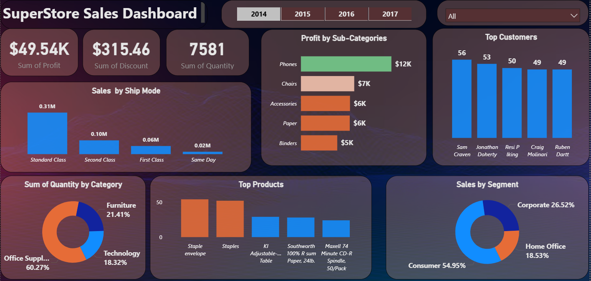

# 🛍️ Super Store Sales Dashboard — Power BI Project

🚀 Just wrapped up my **Super Store Sales Dashboard** in Power BI!  
This interactive report showcases critical business insights and enables strategic decision-making at a glance.

---

## 📊 Dashboard Features

✨ **Key KPIs**  
- 💰 Total **Profit**  
- 🏷️ **Discount**  
- 📦 **Quantity Sold**

📦 **Sales Insights**  
- 🚚 Sales by **Ship Mode**  
- 🧾 Profit by **Sub-Categories**  
- 📊 Quantity by **Product Categories**  
- 🔝 Top Products by **Sales**

🧑‍🤝‍🧑 **Customer Analysis**  
- 📈 Sales Distribution by **Customer Segment**

🧭 **Dynamic Filtering**  
- 🗓️ **Year Selector**  
- 🌍 **Region Selector**

---

## 🛠️ Skills Demonstrated

- 📌 **Data Visualization** in Power BI  
- 🧠 Writing custom **DAX Measures**  
- 🧩 **Interactive Dashboard Design**  
- 🗣️ **Analytical Storytelling** using real-world data

---

## 🎥 Demo Video

👁️‍🗨️ **Watch the dashboard in action:**  
  

---

## 📁 Dataset Source

Dataset: [Superstore Sales Dataset (Kaggle)](https://www.kaggle.com/datasets/tshepangmakhethe/superstore-dataset-final)  
🛒 Includes sales transactions across various regions, customer segments, and product categories.

---

## 💡 Key Learnings

- 📊 Designing visuals that convey maximum insight with minimum noise  
- 🔧 Building **parameterized filters and slicers** for flexibility  
- 📚 Practicing clean layout and dashboard structure for executive use  
- 💬 Communicating data stories with business impact

---

## 🔭 What's Next?

I'm looking forward to:
- ✅ Building more advanced Power BI projects  
- 📈 Exploring BI tools like **Tableau**  
- 🛠️ Working on **end-to-end pipelines** (ETL + Analytics + Reporting)

---

## 🤝 Let’s Connect!

📧 **Email:** [mrmudasir05@gmail.com](mailto:mrmudasir05@gmail.com)  
🔗 **LinkedIn:** [Muhammad Mudassir Azhar](https://www.linkedin.com/in/mudasir-azhar-a80b68237/)  
🌐 **Portfolio:** [Success Story on AICohort.tech](https://aicohort.tech/success-story/muhammad-mudassir-azhar/)

---

> 💬 _“Turning data into insight, and insight into action!”_
